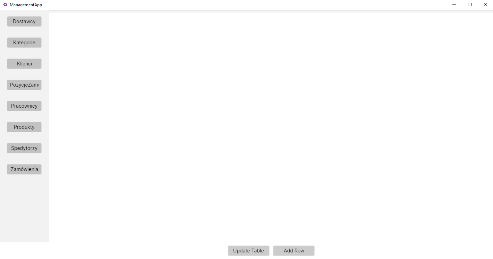
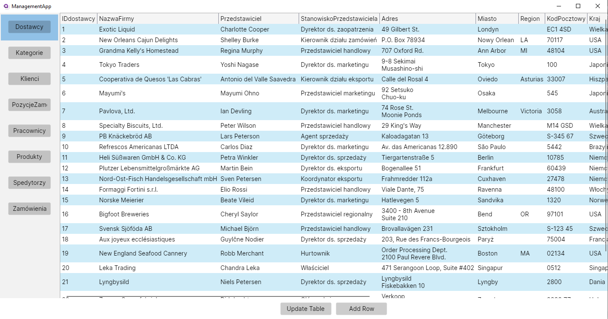

# Opis projektu

Projekt przedstawia prosty program do zarządzania bazą danych na przykładzie bazy danych, której używaliśmy na bazach danych w 3 semestrze. Wyświetla ona dane na postawie _connection stringa_, a następnie daje nam możliwość modifykowania danych oraz dodawania nowych wierszy. Wstępnie miała być także możliwość usuwania zaznaczanych w datagridzie danych, jednak w ostatnim momecie z niej zrezygnowałem, ponieważ mogła prowadzić do niepożądanych efektów kaskadowych na, które ciężko mieć wpływ z perspektywy kodu więc projekt wymagał by o wiele więcej pracy.

# Opis działania poszczególnych funkcji

## Odczyt danych z bazy

Największą wadą programu jest, to że aby odczytać dane z pliku mdf potrzebuje utworzonej dla niej hierarchi w odpowiadającej klasie np.

```cs
namespace ManagementApp.Models
{
    public class Dostawcy
    {
        public int IDdostawcy { get; set; }
        public string? NazwaFirmy { get; set; }
        public string? Przedstawiciel { get; set; }
        public string? StanowiskoPrzedstawiciela { get; set; }
        public string? Adres { get; set; }
        public string? Miasto { get; set; }
        public string? Region { get; set; }
        public string? KodPocztowy { get; set; }
        public string? Kraj { get; set; }
        public string? Telefon { get; set; }
        public string? Faks { get; set; }
        public string? StronaMacierzysta { get; set; }
    }

}
```

Sprawia to, że projekt nigdy nie będzie w 100% dynamiczny jednak nigdy nie próbowałem tutaj zrobić perfekcyjnie działającej komercyjnej aplikacji a zwykły **prototyp**.

Następnie w ViewModelu tworzę instancje dla każdego typu danych z bazy

```cs
private ObservableCollection<Dostawcy> _dostawcy = new ObservableCollection<Dostawcy>();
public ObservableCollection<Dostawcy> Dostawcy
{
    get => _dostawcy;
    set => this.RaiseAndSetIfChanged(ref _dostawcy, value);
}
```

Tworzę także pozostałe konieczne zmienne takie jak `DataGrid`, `Tables`, `TableNames` czy komendy potrzebne później w pliku axaml.

Inicjiuje to wszystko następnie w deklaracji ViewModelu

```cs
public MainWindowViewModel()
{
    Tables = new ObservableCollection<object>();
    TableNames = new ObservableCollection<string>();

    Tables.Clear();
    TableNames.Clear();
    Dostawcy = new ObservableCollection<Dostawcy>(ManagementModelManipulation.ReadDataFromTable<Dostawcy>("Dostawcy", ConnectionsString));
    Tables.Add(Dostawcy);
    TableNames.Add("Dostawcy");
    ...
    ...
    ChangeFocusCommand = new RelayCommand<int>(ChangeFocus);
    UpdateTableCommand = new RelayCommand(UpdateTable);
    AddRowCommand = new RelayCommand(AddEmptyRow);
    Buttons = GenerateButtons();
}
```

Funckja `ReadDataFromTable` wykonuje operacje w SQLu, które zapełniają nasze przygotowane wcześniej klasy, warto zaznaczyć że funkcja ta jest generyczna przez co będzie pasować dla każdego możliwego typu danych.

```cs
public static IEnumerable<T> ReadDataFromTable<T>(string tableName, string con) where T : new()
{
    var objects = new List<T>();

    string connectionString = con;
    using (SqlConnection connection = new SqlConnection(connectionString))
    {
        connection.Open();
        string sql = $"SELECT * FROM {tableName}";
        using (SqlCommand command = new SqlCommand(sql, connection))
        {
            using (SqlDataReader reader = command.ExecuteReader())
            {
                while (reader.Read())
                {
                    T obj = new T();
                    for (int i = 0; i < reader.FieldCount; i++)
                    {
                        PropertyInfo? property = typeof(T).GetProperty(reader.GetName(i));
                        if (property != null && reader.GetValue(i) != DBNull.Value)
                        {
                            try
                            {
                                property.SetValue(obj, reader.GetValue(i));
                            }
                            catch (Exception ex)
                            {
                                Console.WriteLine(ex.Message);
                            }
                        }
                    }
                    objects.Add(obj);
                }
            }
        }
    }

    return objects;
}
```

## Tworzenie komponentów i widoku

Za pomocą funkcji `GenerateButtons()` tworzę przyciski odpowiadający każdej z tabel

```cs
public List<ButtonItem> Buttons { get; }

private List<ButtonItem> GenerateButtons()
{
    var buttons = new List<ButtonItem>();

    for (int i = 0; i < 8; i++)
    {
        var button = new ButtonItem
        {
            Content = TableNames[i],
            Margin = new Thickness(5),
            Tag = i,
            Command = ChangeFocusCommand,
            CommandParameter = i
        };

        buttons.Add(button);
    }

    return buttons;
}
```

Same przyciski utworzyłem w bazie ViewModelu jako element klasy ButtonItem

```cs
public class ButtonItem
{
    public string Content { get; set; }
    public Thickness Margin { get; set; }
    public int Tag { get; set; }
    public ICommand Command { get; set; }
    public int CommandParameter { get; set; }
}
```

Ostatnim krokiem dotyczącym głównie widoku jest złączenie wszystkiego co do tej pory zrobiłem przez nadanie kontekstu dla głównego okna i napisaniu całości naszego widoku.

```cs
namespace ManagementApp.Views
{
    public partial class MainWindow : Window
    {
        private readonly MainWindowViewModel viewModel;
        public MainWindow()
        {
            viewModel = new MainWindowViewModel();
            InitializeComponent();
            DataContext = viewModel;

        }
    }
}
```

```xml
<Window xmlns="https://github.com/avaloniaui"
        xmlns:x="http://schemas.microsoft.com/winfx/2006/xaml"
        xmlns:vm="using:ManagementApp.ViewModels"
        xmlns:d="http://schemas.microsoft.com/expression/blend/2008"
        xmlns:mc="http://schemas.openxmlformats.org/markup-compatibility/2006"
        mc:Ignorable="d" d:DesignWidth="800" d:DesignHeight="450"
        x:Class="ManagementApp.Views.MainWindow"
        x:DataType="vm:MainWindowViewModel"
        Icon="/Assets/avalonia-logo.ico"
        Title="ManagementApp">

	<Grid>
		<Grid.ColumnDefinitions>
			<ColumnDefinition Width="Auto" />
			<ColumnDefinition />
		</Grid.ColumnDefinitions>
		<Grid.RowDefinitions>
			<RowDefinition />
			<RowDefinition Height="Auto" />
		</Grid.RowDefinitions>

		<ListBox Grid.Column="0" Items="{Binding Buttons}">
			<ListBox.ItemTemplate>
				<DataTemplate>
					<Button Content="{Binding Content}"
                            Margin="{Binding Margin}"
                            Tag="{Binding Tag}"
                            Command="{Binding Command}"
                            CommandParameter="{Binding CommandParameter}"
                            Width="100"
                            Height="30"
                            HorizontalAlignment="Left"
                            VerticalAlignment="Center"/>
				</DataTemplate>
			</ListBox.ItemTemplate>
		</ListBox>

		<ScrollViewer Grid.Column="1" HorizontalScrollBarVisibility="Auto">
			<DataGrid x:Name="DataGrid" Items="{Binding DataGrid, Mode=TwoWay}" AutoGenerateColumns="True"/>
		</ScrollViewer>


		<StackPanel Grid.Column="1" Grid.Row="1" Orientation="Horizontal" HorizontalAlignment="Center" Margin="5">
			<Button Content="Update Table" Width="120" Height="30" Margin="5" Command="{Binding UpdateTableCommand}" />
			<Button Content="Add Row" Width="120" Height="30" Margin="5" Command="{Binding AddRowCommand}" />
		</StackPanel>
	</Grid>
</Window>
```

Tutaj zbindowałem wszystkie elementy w sposób taki żeby wszystko się ze sobą zgadzało i w ten sposób otrzymałem widok już końcowy.



Po włączeniu aplikacji główne pole jest puste, jednak po wybraniu tabeli z kolumny po lewej stronie otrzymujemy podgląd tabeli.



## Modifykacja danych

Po naciśnięciu dwa razy na odpowiednią rubrykę możemy ją edytować


Po skończeniu edycji dane zostają na czas naszej sesji, jednak aby zostały wprowadzone pernamentnie do naszej bazy musimy nacisnąć przycisk `Update Table` lub po prostu zmienić tabele.

Gdy to zrobimy aktywuje się funckja `UpdateTable()`

```cs
private void UpdateTable()
{
    var selectedTable = DataGrid as IEnumerable<object>;

    if (selectedTable != null)
    {
        var tableName = TableNames[CurrIndex];
        ManagementModelManipulation.UpdateDatabase(ConnectionsString, tableName, selectedTable);
    }
}
```

Aktualizująca baze danych z modelu

```cs
public async static void UpdateDatabase(string con, string tableName, IEnumerable<object> data)
    {
        using (var connection = new SqlConnection(con))
        {
            connection.Open();

            var transaction = connection.BeginTransaction();

            try
            {
                var deleteCommandText = $"DELETE FROM {tableName}";
                var deleteCommand = new SqlCommand(deleteCommandText, connection, transaction);
                deleteCommand.ExecuteNonQuery();

                var properties = data.FirstOrDefault()?.GetType().GetProperties();
                var insertCommandText = GenerateInsertCommand(tableName, properties);

                foreach (var item in data)
                {
                    var insertCommand = new SqlCommand(insertCommandText, connection, transaction);

                    for (int i = 0; i < properties.Length; i++)
                    {
                        var property = properties[i];
                        var value = property.GetValue(item);

                        if (property.PropertyType == typeof(DateTime) && (DateTime)value < SqlDateTime.MinValue.Value)
                            continue;

                        var parameterName = $"@param{i}";
                        insertCommand.Parameters.AddWithValue(parameterName, value ?? DBNull.Value);
                    }

                    insertCommand.ExecuteNonQuery();
                }

                transaction.Commit();
            }
            catch (SqlException ex)
            {
                var mainWindow = (Window)((IClassicDesktopStyleApplicationLifetime)Application.Current.ApplicationLifetime).MainWindow;
                await ErrorDialog.Show(mainWindow, "Exception Caught", ex.Message, ErrorDialog.MessageBoxButtons.Ok);

                try
                {
                    transaction.Rollback();
                }
                catch (Exception rollbackEx)
                {
                    mainWindow = (Window)((IClassicDesktopStyleApplicationLifetime)Application.Current.ApplicationLifetime).MainWindow;
                    await ErrorDialog.Show(mainWindow, "Exception Caught", rollbackEx.Message, ErrorDialog.MessageBoxButtons.Ok);
                }
            }
        }
    }

    private static string GenerateInsertCommand(string tableName, PropertyInfo[] properties)
    {
        var insertCommand = new StringBuilder();
        insertCommand.AppendLine($"INSERT INTO {tableName}");

        var propertyNames = properties.Select(p => p.Name);
        var columnNames = string.Join(", ", propertyNames);
        var parameterNames = propertyNames.Select((p, i) => $"@param{i}");
        var parameterList = string.Join(", ", parameterNames);

        insertCommand.AppendLine($"({columnNames})");
        insertCommand.AppendLine("VALUES");
        insertCommand.AppendLine($"({parameterList})");

        return insertCommand.ToString();
    }
```

Jest to najdłuższy fragment kodu gdyż funkcja ta uwzględnia tworzenie `rollbacku` jeśli coś pójdzie nie tak aby przywrócić stan bazy danych. Jest to konieczne ponieważ aktualizowanie bazy w tym przypadku działa poprzez usuwanie starej instancji i zastępowanie jej nową. Jest to zabieg konieczny gdyż w wcześniejszym etapie aktualizowałem bazę poprzez aktualizowanie jej wierszy, jedank w momencie gdy dodałem możliwość dodawania nowych wierszy do tabeli stare rozwiązanie przestało działać i musiałem napisać to w taki sposób.

## Obsługa wyjątków

Kolejnym elementem wartym zauważenia może być obsługa wyjątków gdyż w sytuacji, w której użytkowanik zrobi coś źle pojawi się komunikat zawierający dane na temat każdego występującego wyjątku.


_Przykład działania w sytuacji kiedy będziemy próbować podać do tabeli pusty wiersz_

```xml
<Window xmlns="https://github.com/avaloniaui"
        xmlns:x="http://schemas.microsoft.com/winfx/2006/xaml"
        xmlns:d="http://schemas.microsoft.com/expression/blend/2008"
        xmlns:mc="http://schemas.openxmlformats.org/markup-compatibility/2006"
        mc:Ignorable="d" d:DesignWidth="400" d:DesignHeight="150"
        x:Class="ManagementApp.Views.ErrorDialog"
        Title="ErrorDialog">
	<StackPanel HorizontalAlignment="Center">
		<TextBlock HorizontalAlignment="Center" Name="Text"/>
		<StackPanel HorizontalAlignment="Center" Orientation="Horizontal" Name="Buttons">
			<StackPanel.Styles>
				<Style Selector="Button">
					<Setter Property="Margin" Value="5"/>
				</Style>
			</StackPanel.Styles>

		</StackPanel>
	</StackPanel>
</Window>
```

```cs
using System.Threading.Tasks;
using Avalonia.Controls;
using Avalonia.Interactivity;
using Avalonia.Markup.Xaml;

namespace ManagementApp.Views;

public partial class ErrorDialog : Window
{

    public enum MessageBoxButtons
    {
        Ok,
    }

    public enum MessageBoxResult
    {
        Ok,
    }
    public ErrorDialog()
    {
        AvaloniaXamlLoader.Load(this);
    }

    public static Task<MessageBoxResult> Show(Window parent,  string title, string text, MessageBoxButtons buttons)
    {
        var msgbox = new ErrorDialog()
        {
            Title = title
        };
        msgbox.FindControl<TextBlock>("Text").Text = text;
        var buttonPanel = msgbox.FindControl<StackPanel>("Buttons");

        var res = MessageBoxResult.Ok;

        void AddButton(string caption, MessageBoxResult r, bool def = false)
        {
            var btn = new Button { Content = caption };
            btn.Click += (_, __) => {
                res = r;
                msgbox.Close();
            };
            buttonPanel.Children.Add(btn);
            if (def)
                res = r;
        }

        AddButton("Ok", MessageBoxResult.Ok, true);

        var tcs = new TaskCompletionSource<MessageBoxResult>();
        msgbox.Closed += delegate { tcs.TrySetResult(res); };
        if (parent != null)
            msgbox.ShowDialog(parent);
        else msgbox.Show();
        return tcs.Task;
    }
}
```

Widok przygotowany pod obsługę wyjątków został napisany w taki sposób, że bardzo łatwo możemy go zmodyfikować tak żeby dało się dodać komunikaty wymagające naszej uwagi.

## Dodawanie wierszy

Sposób w jaki dodajemy wiersze jest bardzo prosty:

```cs
private void AddEmptyRow()
{
    var table = Tables[CurrIndex];
    Type itemType = table.GetType().GenericTypeArguments.FirstOrDefault();

    if (itemType != null)
    {
        var emptyRow = Activator.CreateInstance(itemType);
        if (table is IList typedTable)
        {
            typedTable.Add(emptyRow);
        }
    }
}
```

Po prostu dodajemy do naszej aktualnej tabel nową pustą instancje, a żeby ją dodać do bazy wystarczy użyć wcześniej opisanej funkcji `Update Table`.
